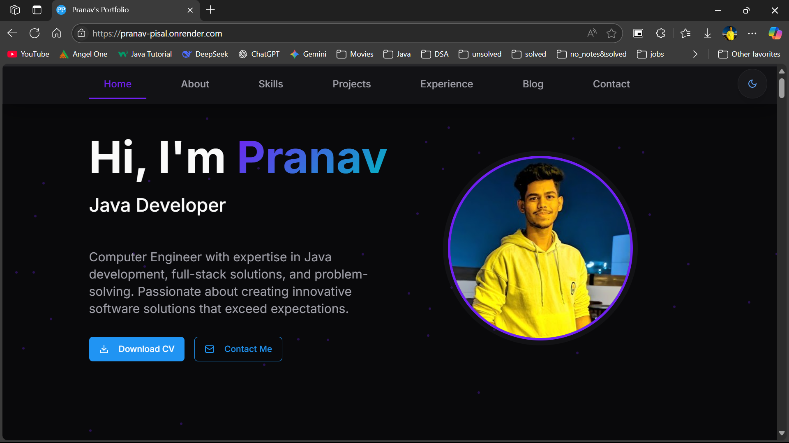
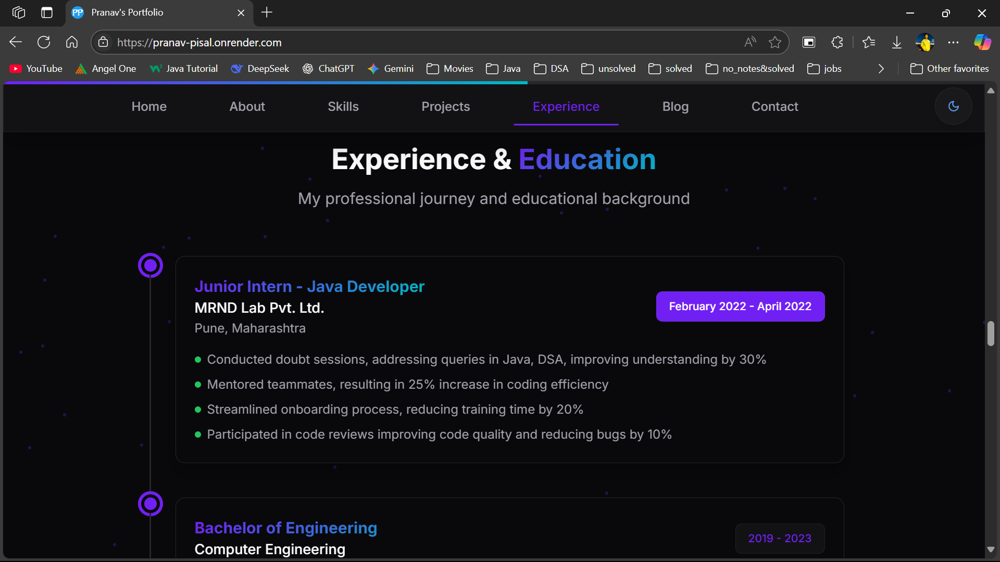

# 🌟 **Pranav Pisal – Personal Portfolio Website**



*A modern, responsive, and minimal portfolio website built to showcase my skills, projects, and achievements.*


## 📌 **Table of Contents**

&nbsp; [🔗 Live Demo](#-live-demo)<br>
&nbsp; [🚀 About the Project](#-about-the-project)<br>
&nbsp; [✨ Features](#-features)<br>
&nbsp; [📷 Screenshots](#-screenshots)<br>
&nbsp; [🛠️ Tech Stack](#️-tech-stack)<br>
&nbsp; [📂 Project Structure](#-project-structure)<br>
&nbsp; [⚙️ Installation & Setup](#️-installation--setup)<br>
&nbsp; [🤝 Contribution Guidelines](#-contribution-guidelines)<br>
&nbsp; [📜 License](#-license)<br>
&nbsp; [📬 Contact](#-contact)

## 🔗 **Live Demo**

[🌐 **View Live Portfolio**](https://pranav-pisal.onrender.com/) 

## 🚀 **About the Project**

This is my **personal portfolio website**, designed to:<br>
&nbsp; ✔ Showcase my **projects, skills, and achievements**<br>
&nbsp; ✔ Provide an **easy way to connect with me**<br>
&nbsp; ✔ Be a **single source of truth for my professional presence**

The website is optimized for performance, SEO-friendly, and suggests **Desktop Mode** for the best experience on mobile devices.

## ✨ **Features**

✅ Fully responsive (Optimized for desktop & mobile) <br>
✅ Light/Dark theme support<br>
✅ Smooth page transitions<br>
✅ Projects with live demo & GitHub links<br>
✅ Contact form & social links<br>
✅ SEO-friendly & fast-loading---

## 📷 **Screenshots**

| Home Section                              | Projects Section                                  | Contact Section                              |
| -------------------------------------- | ---------------------------------------------- | -------------------------------------------- |
|  | <image src="./public/screenshots/projects.png"> | <image src="./public/screenshots/contact.png"> |

| Experiense  Section                              | Skills Section                                  | Blogs Section Section                              |
| -------------------------------------- | ---------------------------------------------- | -------------------------------------------- |
|  | <image src="./public/screenshots/skills.png"> | <image src="./public/screenshots/blogs.png"> |

## 🛠️ **Tech Stack**

### **Core Technologies**

 &nbsp; 
 &nbsp; 
 &nbsp; 

### **Deployment**


## ⚙️ **Installation & Setup**

Clone and run locally:

```bash
# 1️⃣ Clone repo
git clone https://github.com/Pranav128/portfolio-website.git

# 2️⃣ Navigate into project
cd portfolio-website

# 3️⃣ Install dependencies
npm install

# 4️⃣ Run locally
npm run dev

# 5️⃣ Build for production
npm run build
```

## 🤝 **Contribution Guidelines**

Contributions are welcome! To improve design, performance, or add features:

1. **Fork** the repo
2. **Create a new branch** (`git checkout -b feature/amazing-feature`)
3. **Commit changes** (`git commit -m 'Add amazing feature'`)
4. **Push to branch** (`git push origin feature/amazing-feature`)
5. Open a **Pull Request** 🎉

---

## 📜 **License**

This project is licensed under the [**MIT License.**](LICENSE)

## 📬 **Contact**

👤 **Pranav Pisal** <br>
📧 Email: [pranavpisal2528@gmail.com](mailto:pranavpisal2528@gmail.com) <br>
🔗 LinkedIn: [linkedin.com/in/pranav-pisal-06a4271b7](https://www.linkedin.com/in/pranav-pisal-06a4271b7/) <br>
💻 GitHub: [github.com/Pranav128](https://github.com/Pranav128)<br>
🌐 Portfolio: [pranav128.github.io/pranav\_pisal\_portfolio.github.io](https://pranav128.github.io/pranav_pisal_portfolio.github.io/)


✨ **If you like this project, don’t forget to ⭐ the repository!**

---